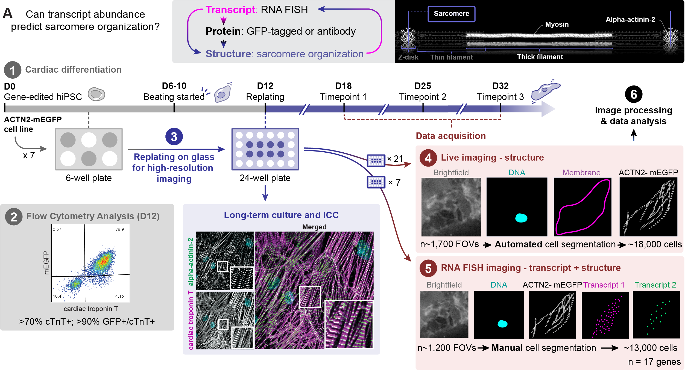
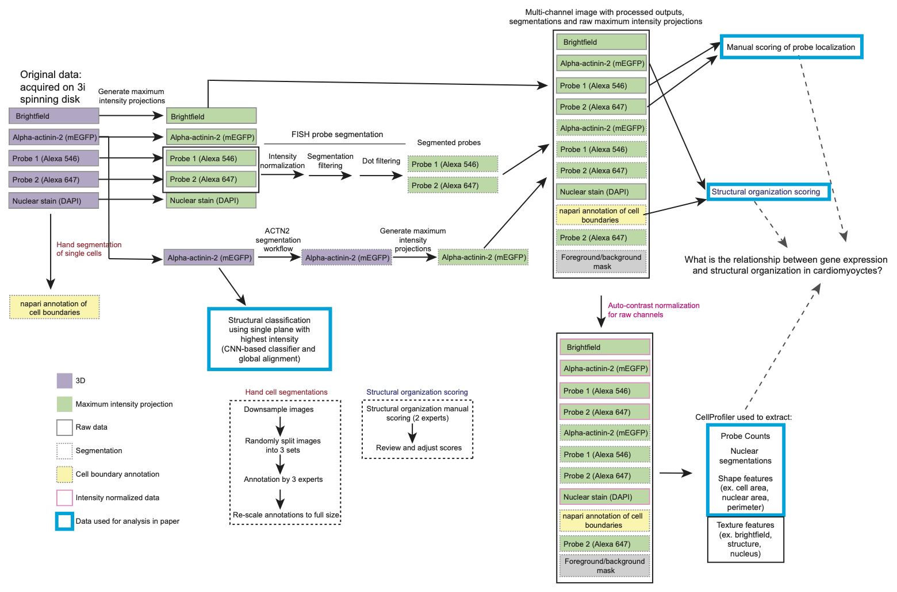

# Data set for _Cell states beyond transcriptomics: integrating structural organization and gene expression in hiPSC-derived cardiomyocytes_

This data package contains the input data for all analyses in the manuscript [_Cell states beyond transcriptomics: integrating structural organization and gene expression in hiPSC-derived cardiomyocytes_](https://doi.org/10.1016/j.cels.2021.05.001) in a compute-friendly form.
Not all of these data were used in the manuscript, but all of the data used in the manuscript are included here.

In this manuscript, we used hiPSC-derived cardiomyocytes as a model system for studying the relationship between transcript abundance and cellular organization as shown below.


## Overview
Notably, we provide 2,911 fields of view (FOVs) containing segmented single cells in different stages of cardiomyogenesis. There are 1,215 FOVs 
from RNA-FISH experiments (FISH; 12,941 cells) and 1,696 FOVs of live imaged cardiomyocytes (Live; 18,045 cells). The following channels were imaged:
- Brightfield
- Hoechst nuclear stain
- Endogenously GFP-tagged alpha-actinin-2 structure
- Two FISH probes per cell (FISH FOVs only; 18 probes overall)

Also included are
- expert scoring of sarcomere structure organization of 6,677 cells (5,755 scored cells from FISH; 922 scored cells from Live)

## Organization
The data in this package is organized into separate data sets, reflecting different data of different types (FISH/Live image data), and different downstream processing / feature derivation.

The data sets included in this package are:

### Raw 3D images:

```bash
   raw_images
   ├──FISH 
   ├──Live 
```

### FISH 2D segmented cells
```bash
   ├──2d_segmented_fields_fish_1 
   ├──2d_segmented_fields_fish_2
   ├──2d_segmented_fields_fish_3
   ├──2d_segmented_fields_fish_4
```

### FISH 2D FOVs used as input to cellprofiler
```bash
   ├──2d_autocontrasted_fields_and_single_cells_fish_1
   ├──2d_autocontrasted_fields_and_single_cells_fish_2
   ├──2d_autocontrasted_fields_and_single_cells_fish_3
   ├──2d_autocontrasted_fields_and_single_cells_fish_4
```


### Cellprofiler output
```bash
   ├──2d_autocontrasted_single_cell_features_fish_1
   ├──2d_autocontrasted_single_cell_features_fish_2
   ├──2d_autocontrasted_single_cell_features_fish_3
   ├──2d_autocontrasted_single_cell_features_fish_4
```

### Structure classifier
```bash
   ├──automated_local_and_global_structure_fish_1
   ├──automated_local_and_global_structure_fish_2
   ├──automated_local_and_global_structure_fish_3
   ├──automated_local_and_global_structure_fish_4
   ├──automated_local_and_global_structure_live
```

### Cell features used to make manuscript figures
```bash
   revised_manuscript_plots
   ├──data.csv
```

The data creation and processing pipeline is organized according to the following schematic:



## Access
The data are programmatically accessible via `quilt`, and is also (somewhat) browse-able via this web ui.

### Bulk download
To download the entire data set, install the `quilt` python package using
```bash
pip install quilt
```
and then
```python
import quilt3
b = quilt3.Bucket("s3://allencell")
b.fetch("aics/integrated_transcriptomics_structural_organization_hipsc_cm/", "./")
```

### Download specific files or data sets
To download only certain individual files, navigate the web ui here to the specific file you are interested in, and use the `DOWNLOAD FILE` button in the upper right of the page.

To download specific folders/directories of data, similarly use the web ui to find the directory you want, and check the `<> CODE` tab at the top of the page for the python code that downloads that specific subset of data.

### Programmatic access
To access the data via the python quilt API, install `quilt` via `pip`, and then load the package with:

```python
pkg = quilt3.Package.browse(
    "aics/integrated_transcriptomics_structural_organization_hipsc_cm",
    "s3://allencell",
)
```
Instructions for interacting with quilt packages in Python can be found [here](https://docs.quiltdata.com/walkthrough/getting-data-from-a-package).

## Citation
```
@article{Gerbin2021,
    author = {Gerbin, K. A. and Grancharova, T. and Donovan-Maiye, R. M. and Hendershott, M. C. and Anderson, H. G. and Brown, J. M. and Chen, J. and Dinh, S. Q. and Gehring, J. L. and Johnson, G. R. and Lee, H. and Nath, A. and Nelson, A. M. and Sluzewski, M. F. and Viana, M. P. and Yan, C. and Zaunbrecher, R. J. and Cordes Metzler, K. R. and Gaudreault, N. and Knijnenburg, T. A. and Rafelski, S. M. and Theriot, J. A. and Gunawardane, R. N.},
    title = {Cell states beyond transcriptomics: Integrating structural organization and gene expression in hiPSC-derived cardiomyocytes},
    journal = {Cell Syst},
    volume = {12},
    number = {6},
    pages = {670-687 e10},
    ISSN = {2405-4720 (Electronic)
    2405-4712 (Linking)},
    DOI = {10.1016/j.cels.2021.05.001},
    url = {https://doi.org/10.1016/j.cels.2021.05.001},
    year = {2021},
    type = {Journal Article}
}
```

## License
For questions on licensing please refer to https://www.allencell.org/terms-of-use.html.

## Contact
Allen Institute for Cell Science E-mail: cells@alleninstitute.org

## Feedback
Feedback on benefits and issues you discovered while using this data package is greatly appreciated. [Feedback Form](https://forms.gle/GUBC3zU5kuA8wyS17)
